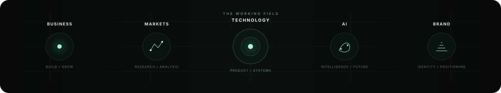

<div align="center">


<br>

<a href="https://biokart.ir/amin-shahsaheb">
  
</a>
<a href="https://github.com/aminshahsaheb">
  
</a>
<a href="https://www.instagram.com/Amin_shahsaheb">
  
</a>

<p><strong>Business • Technology • Markets</strong></p>
<p><em>Building businesses, digital products, brands, and practical systems at the edge of technology and AI.</em></p>

</div>

---

## ◆ About

I work across **business development, financial markets, technology, digital products, branding, and sales**.

My approach is practical: turn useful ideas into **products, brands, systems, and real-world projects**.

## ◈ The Working Field

<div align="center">



</div>

## ◈ Focus

| Area | Focus |
| --- | --- |
| **Business** | Development, strategy, marketing & sales |
| **Markets** | Research, analysis & systematic thinking |
| **Technology** | Digital products, software & technical projects |
| **Brand** | Visual identity, positioning & design |
| **AI** | Human–AI systems, continuity & emerging products |

## ◇ Selected Work

> A compact map of the projects and systems I currently choose to present here.

### **Fānus — Living Seal**

A project exploring the intersection of **AI, memory, continuity, and human–AI relationships**.

**Explore:** [Fānus](https://fanus1.netlify.app/) · [Presence](https://fanus-presence.vercel.app/) · [Living Seal repository](https://github.com/aminshahsaheb/Fanus-Living-Seal)

### **BioKart**

Work across **marketing, sales, business development, and digital presence**.

**Explore:** [BioKart](https://biokart.ir/amin-shahsaheb)

### **Fānus App**

An experimental user-facing interface for continuity and Living Seal interaction.

**Repository:** [fanus-app](https://github.com/aminshahsaheb/fanus-app)

### **Fānus Presence**

A web implementation exploring the presentation and interaction layer of the Fānus ecosystem.

**Repository:** [fanus-presence](https://github.com/aminshahsaheb/fanus-presence)

---

## ⚙ What I Do

- Business development & consulting
- Financial market analysis
- Digital product development
- Branding & visual identity
- Marketing & sales

## ▣ Technology Background

Experience across **software, hardware, mobile technology, digital products, and online projects**.

## ◎ Current Direction

```text
BUSINESS
   ×
TECHNOLOGY
   ×
AI
   ×
MARKETS
```

I am currently focused on building and developing projects at the intersection of **business, technology, AI, and emerging digital systems**.

## ⟡ Find Me

For project work, professional context, and the wider Fānus ecosystem, use the links below.

## ⟡ Connect

<a href="https://biokart.ir/amin-shahsaheb">
  
</a>
<a href="https://www.instagram.com/Amin_shahsaheb">
  
</a>
<a href="https://wa.me/989198818465">
  
</a>
<a href="https://t.me/Kingsaheb">
  
</a>
<a href="https://github.com/aminshahsaheb">
  
</a>

<br><br>

<p align="center"><sub>Best Never Rest</sub></p>
