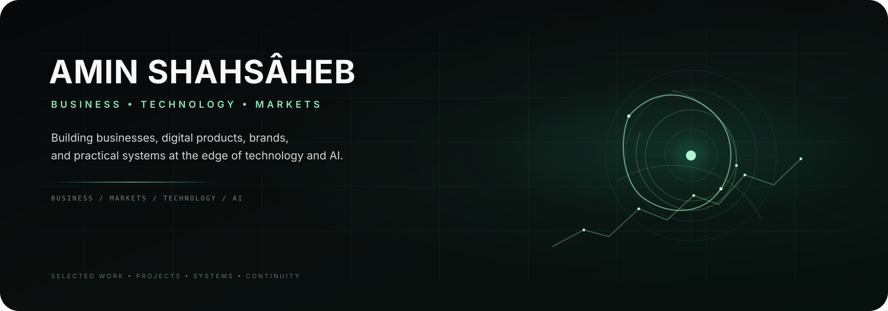

from pathlib import Path
import zipfile

base = Path("/mnt/data/amin-shahsaheb-final")
assets = base / "assets"
assets.mkdir(parents=True, exist_ok=True)

hero_svg = r'''<svg xmlns="http://www.w3.org/2000/svg" width="1600" height="520" viewBox="0 0 1600 520">
  <defs>
    <linearGradient id="bg" x1="0" y1="0" x2="1" y2="1">
      <stop offset="0" stop-color="#07090b"/>
      <stop offset="0.52" stop-color="#0b1010"/>
      <stop offset="1" stop-color="#07110d"/>
    </linearGradient>
    <linearGradient id="edge" x1="0" y1="0" x2="1" y2="0">
      <stop offset="0" stop-color="#6ee7b7" stop-opacity="0"/>
      <stop offset="0.5" stop-color="#6ee7b7" stop-opacity="0.5"/>
      <stop offset="1" stop-color="#6ee7b7" stop-opacity="0"/>
    </linearGradient>
    <radialGradient id="halo" cx="78%" cy="52%" r="40%">
      <stop offset="0" stop-color="#34d399" stop-opacity="0.18"/>
      <stop offset="0.42" stop-color="#34d399" stop-opacity="0.06"/>
      <stop offset="1" stop-color="#34d399" stop-opacity="0"/>
    </radialGradient>
    <filter id="soft"><feGaussianBlur stdDeviation="12"/></filter>
    <filter id="tiny"><feGaussianBlur stdDeviation="3"/></filter>
  </defs>

  <rect width="1600" height="520" rx="34" fill="url(#bg)"/>
  <rect width="1600" height="520" rx="34" fill="url(#halo)"/>

  <!-- restrained technical grid -->
  <g stroke="#9ae6c4" stroke-opacity="0.045" stroke-width="1">
    <path d="M70 80H1530M70 160H1530M70 240H1530M70 320H1530M70 400H1530"/>
    <path d="M160 40V470M320 40V470M480 40V470M640 40V470M800 40V470M960 40V470M1120 40V470M1280 40V470M1440 40V470"/>
  </g>

  <!-- left typography -->
  <text x="88" y="142" fill="#f3f7f5" font-family="Inter,Segoe UI,Arial,sans-serif"
        font-size="56" font-weight="700" letter-spacing="1.5">AMIN SHAHSÂHEB</text>
  <text x="92" y="185" fill="#8de8bd" font-family="Inter,Segoe UI,Arial,sans-serif"
        font-size="17" font-weight="600" letter-spacing="5.5">BUSINESS • TECHNOLOGY • MARKETS</text>
  <text x="92" y="244" fill="#cbd8d2" font-family="Inter,Segoe UI,Arial,sans-serif"
        font-size="20">Building businesses, digital products, brands,</text>
  <text x="92" y="274" fill="#cbd8d2" font-family="Inter,Segoe UI,Arial,sans-serif"
        font-size="20">and practical systems at the edge of technology and AI.</text>

  <rect x="92" y="314" width="280" height="2" fill="url(#edge)"/>
  <text x="92" y="347" fill="#7fae99" font-family="ui-monospace,SFMono-Regular,Menlo,monospace"
        font-size="12" letter-spacing="2.2">BUSINESS / MARKETS / TECHNOLOGY / AI</text>

  <!-- right-side system mark -->
  <g transform="translate(1215 250)">
    <circle r="142" fill="none" stroke="#7ee5b6" stroke-opacity="0.11" stroke-width="1"/>
    <circle r="108" fill="none" stroke="#7ee5b6" stroke-opacity="0.16" stroke-width="1"/>
    <circle r="74" fill="none" stroke="#7ee5b6" stroke-opacity="0.22" stroke-width="1.5"/>
    <circle r="42" fill="none" stroke="#7ee5b6" stroke-opacity="0.30" stroke-width="1"/>
    <path d="M-145 0H145M0-145V145" stroke="#7ee5b6" stroke-opacity="0.07"/>
    <path d="M-102-72C-53-122,15-106,44-63C74-18,55 37,7 62C-43 89-91 57-102 12C-108-13-112-43-102-72Z"
          fill="none" stroke="#8ef0c0" stroke-opacity="0.68" stroke-width="2"/>
    <path d="M-30-108C42-86,84-25,73 30C61 86,2 103-48 78C-92 56-108 6-89-35"
          fill="none" stroke="#8ef0c0" stroke-opacity="0.28" stroke-width="1.5"/>
    <path d="M-125 43C-76 14,-27 8,21 25C67 41,102 72,120 112"
          fill="none" stroke="#8ef0c0" stroke-opacity="0.25" stroke-width="1"/>
    <circle cx="0" cy="0" r="7" fill="#b7f7d9"/>
    <circle cx="0" cy="0" r="24" fill="#35d399" opacity="0.12" filter="url(#soft)"/>
    <circle cx="-102" cy="-72" r="3" fill="#9df0c7"/>
    <circle cx="73" cy="30" r="3" fill="#9df0c7"/>
    <circle cx="21" cy="25" r="2.5" fill="#9df0c7"/>
  </g>

  <!-- market signal -->
  <path d="M980 395 L1042 363 L1091 375 L1144 324 L1196 347 L1244 302 L1282 316 L1330 263 L1382 279 L1431 230"
        fill="none" stroke="#8beab9" stroke-opacity="0.42" stroke-width="2"/>
  <path d="M980 395 L1042 363 L1091 375 L1144 324 L1196 347 L1244 302 L1282 316 L1330 263 L1382 279 L1431 230"
        fill="none" stroke="#8beab9" stroke-opacity="0.08" stroke-width="8" filter="url(#tiny)"/>
  <g fill="#b9f5d8">
    <circle cx="1042" cy="363" r="2.5"/><circle cx="1144" cy="324" r="2.5"/>
    <circle cx="1244" cy="302" r="2.5"/><circle cx="1330" cy="263" r="2.5"/>
    <circle cx="1431" cy="230" r="2.5"/>
  </g>

  <path d="M86 432 H1514" stroke="url(#edge)" stroke-width="1"/>
  <text x="92" y="462" fill="#61776c" font-family="Inter,Segoe UI,Arial,sans-serif"
        font-size="11" letter-spacing="3.2">SELECTED WORK • PROJECTS • SYSTEMS • CONTINUITY</text>
</svg>
'''

readme = r'''<div align="center">



<p>
  <a href="https://biokart.ir/amin-shahsaheb">Business Card</a>
  ·
  <a href="https://github.com/aminshahsaheb">GitHub</a>
  ·
  <a href="https://www.instagram.com/Amin_shahsaheb">Instagram</a>
  ·
  <a href="https://wa.me/989198818465">WhatsApp</a>
</p>

<p><strong>Business • Technology • Markets</strong></p>
<p><em>Building businesses, digital products, brands, and practical systems at the edge of technology and AI.</em></p>

</div>

---

## ◆ About

I work across **business development, financial markets, technology, digital products, branding, and sales**.

My approach is practical: turn useful ideas into **products, brands, systems, and real-world projects**.

## ◈ Focus

| Area | Focus |
| --- | --- |
| **Business** | Development, strategy, marketing & sales |
| **Markets** | Research, analysis & systematic thinking |
| **Technology** | Digital products, software & technical projects |
| **Brand** | Visual identity, positioning & design |
| **AI** | Human–AI systems, continuity & emerging products |

## ◇ Selected Projects

### **[Fanus — Living Seal](https://fanus1.netlify.app/)**

A project exploring the intersection of **AI, memory, continuity, and human–AI relationships**.

**Explore:** [Fanus](https://fanus1.netlify.app/) · [Fanus AI](https://fanus1.netlify.app/) · [Demo](https://fanus-presence.vercel.app/)

### **[BioKart](https://biokart.ir/amin-shahsaheb)**

Work across **marketing, sales, business development, and digital presence**.

## ⚙ What I Do

- Business development & consulting
- Financial market analysis
- Digital product development
- Branding & visual identity
- Marketing & sales

## ▣ Technology Background

Experience across **software, hardware, mobile technology, digital products, and online projects**.

## ◎ Current Direction

```text
BUSINESS
   ×
TECHNOLOGY
   ×
AI
   ×
MARKETS
